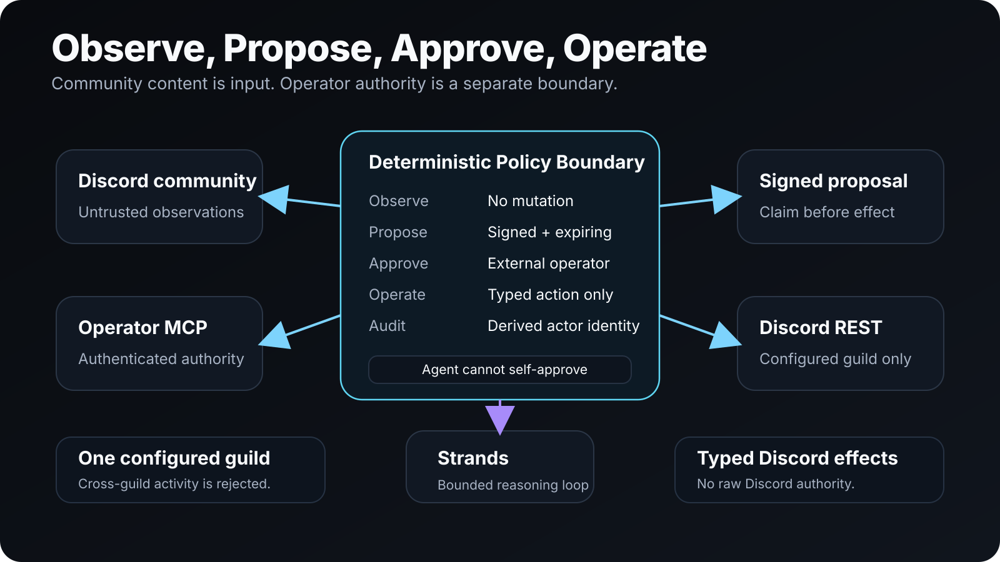

# Discord Manager

**A private, approval-gated community operator for Discord.**

Discord Manager is a Strands-powered control plane for operating one Discord community from an authenticated MCP client or CLI. Community messages are observations, not instructions; deterministic policy owns trust, proposals, approvals, and Discord mutations.

[Hackathon submission](HACKATHON_SUBMISSION.md) · [Demo runbook](DEMO_RUNBOOK.md) · [Architecture](docs/ARCHITECTURE.svg) · [Source](https://github.com/tjXJNOOBIE/Community-Agent)



## Why Discord Manager

Community automation has an authority problem. A public chatbot that treats every Discord message as an instruction is unsafe, while a passive assistant that cannot verify or control effects is not much of an operator.

Discord Manager separates **community observation** from **operator authority**. One running configuration observes and operates exactly one configured guild. Messages from ordinary members remain untrusted input. Sensitive actions are represented as typed operations and can be forced through a signed, expiring proposal before Discord sees a mutation.

## What it does

The runnable release provides a narrow but real control loop:

- inspect the configured Discord guild and channels through a typed Discord REST boundary;
- create signed, expiring `PROPOSE` records without giving the internal agent an approval tool;
- approve one supported typed action, `send_message`, from the authenticated operator surface;
- durably claim an approval before the external effect so concurrent approvals execute at most once;
- record proposal transitions in a private append-only JSONL audit file;
- start a real Strands runtime through the shared bridge for one-shot reasoning;
- expose separate internal-agent and operator MCP surfaces;
- provide an installation wizard, token-safe doctor, and loopback-only HTTP dashboard.

The broader gateway, moderation, events, support, content, and subscription-worker design is documented, but it is not represented as physically accepted until the required Discord test environment and credentials exist.

## One community, explicit authority

```text
ChatGPT / Claude / Web / CLI
            |
      operator MCP/API
            |
      Discord Manager
            |
  root Strands coordinator
     /   /   |   \   \
community moderation support events content server-ops
            |
       internal MCP
            |
 deterministic handlers/policy
       /           \
Discord REST     subscription workers
```

The internal MCP surface can inspect and propose. It cannot approve its own proposal or rewrite the machine-owned trust policy.

## Bounded by design

Discord Manager intentionally keeps the model away from raw Discord authority.

- Ordinary Discord messages are untrusted observations by default.
- Trusted Discord prompting is disabled unless machine/operator configuration explicitly enables it.
- Gateway events from other guilds are ignored.
- Channel/thread reads and mutations are verified against the configured guild before reaching Discord.
- `OBSERVE`, `PROPOSE`, and `OPERATE` are deterministic policy outcomes.
- Proposal tokens are HMAC-signed, expiring, and claimed durably before an effect.
- Control surfaces derive their own audit actor identity; callers cannot spoof `requestedBy` or `approvedBy` labels.
- Discord ingress cannot mutate trusted-controller configuration.
- The daemon stays loopback-bound; remote access belongs behind an authenticated HTTPS reverse proxy or tunnel.
- The Discord bot should not be granted Administrator permission.

## Install

### Requirements

- Node.js 22+
- a Discord application and bot user
- a target Discord guild for physical acceptance

From source:

```bash
git clone https://github.com/tjXJNOOBIE/Community-Agent.git
cd Community-Agent
npm install
npm run build
npm run check
```

For packaged-consumer testing, build the tarball and install it into a clean project:

```bash
npm pack
mkdir community-manager-consumer && cd community-manager-consumer
npm init -y
npm install /path/to/tjxjnoobie-community-agent-0.1.0.tgz
npx --no-install community-agent install
```

The installer creates `~/.community-agent/config.json` with private permissions, generates operator/internal/proposal secrets, and prints the Discord guild-install URL.

## Discord setup

1. Create a Discord application and enable its Bot user.
2. Enable **Message Content Intent**. The product does not require the privileged Server Members Intent.
3. Enable Discord Developer Mode so guild/channel/user IDs can be copied.
4. Run the installer and add the bot to the target guild using the generated invite URL.
5. Keep the bot token in the environment, never in repository or config state:

```bash
export COMMUNITY_AGENT_DISCORD_BOT_TOKEN='...'
community-agent doctor
```

The doctor validates bot identity, guild access, Message Content intent, install permissions, configured channel references, effective permission overwrites, and role-hierarchy limitations.

Start the control plane with:

```bash
community-agent serve
```

The local dashboard defaults to `http://127.0.0.1:3210`.

## Control surfaces

When `serve` is running:

| Surface | Authority |
| --- | --- |
| `POST /mcp/agent` | Private internal Strands tools. Can inspect and propose, but cannot approve. |
| `POST /mcp/operator` | Private operator MCP. Can inspect, propose, list, and approve supported actions. |
| `/api/*` | Authenticated operator HTTP API. |
| `/` | Local web control surface. |

Both MCP endpoints require their generated bearer tokens and negotiate MCP protocol version `2025-11-25`.

For remote browser or ChatGPT Web MCP access, keep the daemon on loopback and terminate TLS/authentication at a trusted proxy or tunnel. Remote hosts and browser origins are exact allowlists.

## Autonomy model

Every managed mutation resolves through one policy:

| Policy | Result |
| --- | --- |
| `OBSERVE` | No mutation and no proposal. |
| `PROPOSE` | Create a signed, expiring proposal; wait for external operator approval. |
| `OPERATE` | Execute the typed action immediately. |

The current accepted mutation is `send_message`, reached through a signed proposal. Wider sensitive operations remain design-level until their typed implementations and physical acceptance are complete.

## Subscription workers

Machine configuration includes disabled-by-policy worker definitions for Codex and Claude. They are subprocess boundaries, not Discord commands.

Worker execution uses `shell: false`, passes prompts on stdin, canonicalizes working directories, restricts environment variables, caps output, enforces termination bounds, and reports typed termination reasons. Discord users cannot modify worker commands or trusted execution scope.

## Validate the release

```bash
npm install
npm run check
npm pack --dry-run
```

Architecture checks enforce the key invariants: no direct Strands SDK ownership in the product, no direct Discord mutation from agent reasoning, no internal-agent approval capability, no trust-policy mutation from Discord ingress, derived audit identities, and bounded production state ownership.

Physical Discord mutation and model-backed Strands invocation require a real development guild, bot token, and authorized model/runtime surface. The repository keeps that credential boundary explicit.

## Hackathon evidence

- [`HACKATHON_SUBMISSION.md`](HACKATHON_SUBMISSION.md) contains the hackathon framing and pre-existing-component disclosure.
- [`DEMO_RUNBOOK.md`](DEMO_RUNBOOK.md) contains the authenticated MCP and physical Discord acceptance path.
- [`docs/ARCHITECTURE.svg`](docs/ARCHITECTURE.svg) shows the operator/agent/policy boundary.
- [`docs/community-agent/COMMUNITY_AGENT_FINAL_DRAFT.md`](docs/community-agent/COMMUNITY_AGENT_FINAL_DRAFT.md) documents the broader reviewed design.

The project is released under the [MIT License](LICENSE).
