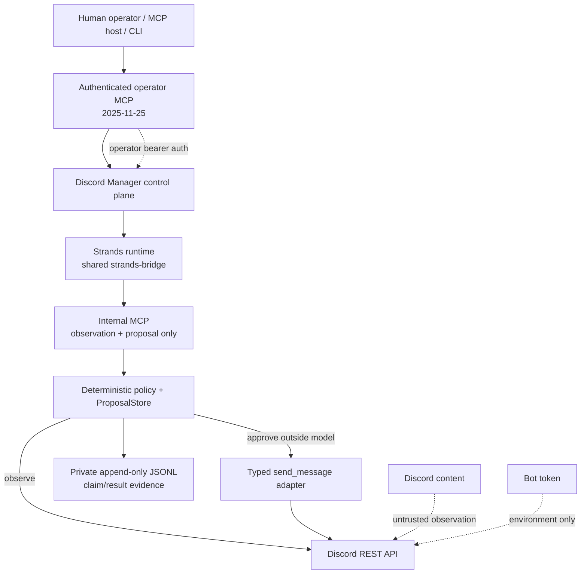

# Discord Manager architecture

The operator surface and internal agent surface are intentionally separate. The model cannot approve its own proposal, and Discord content does not acquire instruction authority merely because it is visible to the bot.
